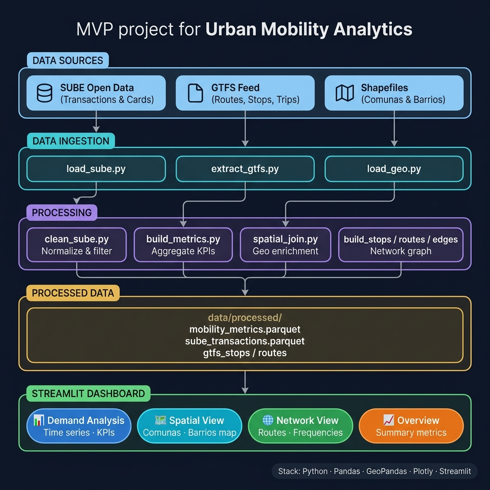

# Urban Mobility Analytics MVP (Argentina)

## Project Description
This project is an urban mobility analytics prototype based on open data from Argentina's public transport system. Its goal is to analyze aggregate mobility patterns using demand signals from the SUBE system and the public transit network structure (GTFS), incorporating geographic context.
The system is designed as a reproducible foundation for public mobility policy analysis and as a starting point for future extensions toward origin-destination (OD) models.

## Architecture



## Repository Structure
```text
urban-mobility-mvp/
│
├── README.md
├── requirements.txt
├── .gitignore
├── config.yaml
│
├── data/
│   ├── raw/
│   │   ├── sube_transactions.csv
│   │   ├── sube_cards.csv
│   │   ├── gtfs.zip
│   │   └── geo_boundaries.geojson
│   │
│   ├── processed/
│   │   ├── sube_clean.parquet
│   │   ├── mobility_metrics.parquet
│   │   └── gtfs_graph.parquet
│   │
│   └── external/
│       └── (optional datasets downloaded)
│
├── notebooks/
│   ├── 01_data_exploration.ipynb
│   ├── 02_sube_analysis.ipynb
│   ├── 03_gtfs_processing.ipynb
│   └── 04_mvp_insights.ipynb
│
├── src/
│   │
│   ├── data_ingestion/
│   │   ├── load_sube.py
│   │   ├── load_gtfs.py
│   │   └── load_geo.py
│   │
│   ├── processing/
│   │   ├── clean_sube.py
│   │   ├── build_metrics.py
│   │   └── gtfs_to_graph.py
│   │
│   ├── analytics/
│   │   ├── demand_analysis.py
│   │   ├── mobility_metrics.py
│   │   └── temporal_patterns.py
│   │
│   ├── geospatial/
│   │   ├── mapping.py
│   │   └── spatial_join.py
│   │
│   └── utils/
│       ├── config_loader.py
│       ├── logger.py
│       └── helpers.py
│
├── dashboard/
│   ├── app.py
│   ├── pages/
│   │   ├── overview.py
│   │   ├── demand.py
│   │   ├── network.py
│   │   └── spatial.py
│   │
│   └── components/
│       ├── charts.py
│       └── maps.py
│
├── gtfs_processing/
│   ├── extract_gtfs.py
│   ├── build_stops.py
│   ├── build_routes.py
│   ├── build_edges.py
│   └── gtfs_pipeline.py
│
├── models/
│   └── (empty for now / future OD inference)
│
├── outputs/
│   ├── figures/
│   ├── maps/
│   └── reports/
│
└── docs/
    ├── methodology.md
    ├── data_sources.md
    └── limitations.md
```

## Objective
Build a system that allows to:
* Analyze urban mobility demand using aggregated SUBE data
* Understand public transport network structure using GTFS
* Incorporate geographic context for spatial analysis
* Generate basic mobility indicators to support public policy decision-making

## Data Sources Used

### SUBE – Mobility Demand
* Number of transactions per date (system usage)
* Number of unique cards per date (active users)

### GTFS – Public Transport Network
* Stops
* Lines and routes
* Scheduled trips
* Stop sequences (stop_times)

### Geographic Data
* Administrative boundaries (CABA / AMBA)
* Geographic layers for spatial visualization

## System Features

### 1. Mobility Demand Analysis
* Temporal evolution of estimated trips (SUBE transactions)
* Evolution of active users (unique cards)
* Identification of daily mobility peaks and weekly patterns

### 2. User Behavior Analysis
* Relationship between active users and transaction volume
* System usage intensity indicators
* Comparison of activity across different periods

### 3. Transport Network Modeling (GTFS)
* Public transit network representation as a graph
* Visualization of stops and routes
* Connectivity representation of the system

### 4. Geospatial Analysis
* Visualization of mobility on maps
* Spatial distribution of transport infrastructure
* Analysis by administrative zones

### 5. Interactive Dashboard
* Visualization of mobility time series
* Public transport network maps
* Comparison of demand metrics
* Basic exploration of urban indicators

## Project Scope
This MVP focuses on aggregate urban mobility analysis and does not include:
* Individual-based origin-destination (OD) models
* User tracking or personal data
* Real-time data integration
* Advanced ML predictive models

## Possible Future Extensions
* Inference of origin-destination (OD) matrices
* Integration with real-time traffic data
* Multimodal analysis (bicycles, walking, etc.)
* Demand forecasting models
* Integration with tariff policies or urban events
* Expansion to multiple cities / countries

## Project Approach
This project prioritizes:
* Use of open and reproducible data
* Transparency in analysis processes
* Scalability to other urban contexts
* Applicability in evidence-based public policies
